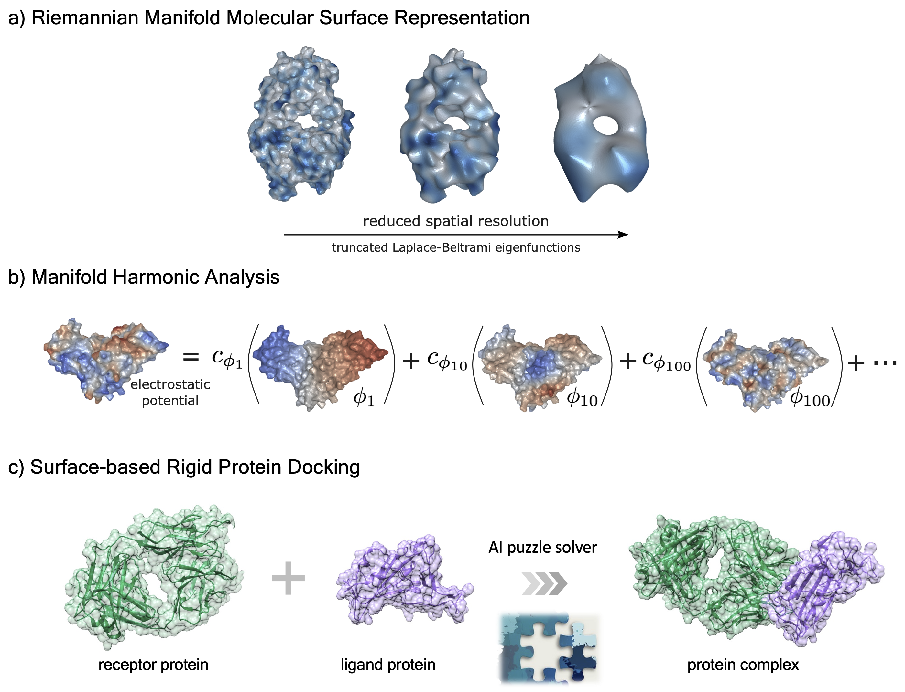

# HMR: Harmonic Molecular Representation on Riemannian Manifold


This is the code repository for our ICLR 2023 paper 
[Learning Harmonic Molecular Representations on Riemannian Manifold](https://openreview.net/pdf?id=ySCL-NG_I3)

<p align='center'>

</p>

## Dependencies

This work was developed and tested under pytorch 1.10.0 with CUDA 11.3. Please install dependencies as follows:


```bash
# We recommend using conda for environment management
conda create -n HMR python=3.7.3 
conda activate HMR

pip install -r requirements.txt

# install PyMesh for surface mesh processing
PYMESH_PATH="~/PyMesh" # substitute with your own PyMesh path
git clone https://github.com/PyMesh/PyMesh.git $PYMESH_PATH 
cd $PYMESH_PATH 
git submodule update --init
apt-get update
# make sure you have these libraries installed before building PyMesh
apt-get install cmake libgmp-dev libmpfr-dev libgmpxx4ldbl libboost-dev libboost-thread-dev libopenmpi-dev
cd $PYMESH_PATH/third_party
python build.py all # build third party dependencies
cd $PYMESH_PATH
mkdir build
cd build
cmake ..
make -j # check for missing third-party dependencies if failed to make
cd $PYMESH_PATH
python setup.py install
python -c "import pymesh; pymesh.test()"

# install meshplot
conda install -c conda-forge meshplot

# install libigl
conda install -c conda-forge igl

# download MSMS
MSMS_PATH="~/MSMS" # substitute with your own MSMS path
wget https://ccsb.scripps.edu/msms/download/933/ -O msms_i86_64Linux2_2.6.1.tar.gz
mkdir -p $MSMS_PATH # mark this directory as your $MSMS_bin for later use
tar zxvf msms_i86_64Linux2_2.6.1.tar.gz -C $MSMS_PATH

# install PyTorch 1.10.0 (e.g., with CUDA 11.3)
conda install pytorch==1.10.0 cudatoolkit=11.3 -c pytorch -c conda-forge
pip install torch-scatter -f https://data.pyg.org/whl/torch-1.10.0+cu113.html


# install HMR
pip install -e . 

```


## Reproduce paper results

Please refer to each folder under `tasks` for details on reproducing results from the paper. 
Data and models can be downloaded from Zonodo (https://zenodo.org/record/7686423#.ZAq_9ezMJf1).

## Citation
```
@inproceedings{
wang2023learning,
title={Learning Harmonic Molecular Representations on Riemannian Manifold},
author={Yiqun Wang and Yuning Shen and Shi Chen and Lihao Wang and Fei YE and Hao Zhou},
booktitle={The Eleventh International Conference on Learning Representations },
year={2023},
url={https://openreview.net/forum?id=ySCL-NG_I3}
}
```

## License

<a rel="license" href="http://creativecommons.org/licenses/by-nc/4.0/"></a><br />This work is licensed under a <a rel="license" href="http://creativecommons.org/licenses/by-nc/4.0/">Creative Commons Attribution-NonCommercial 4.0 International License</a>.